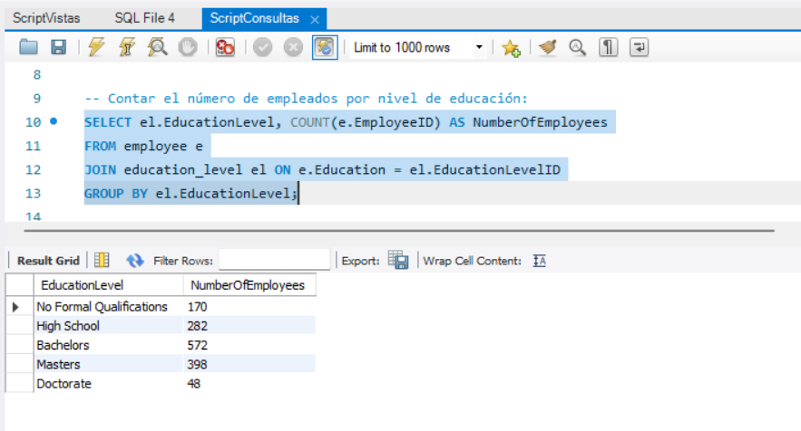
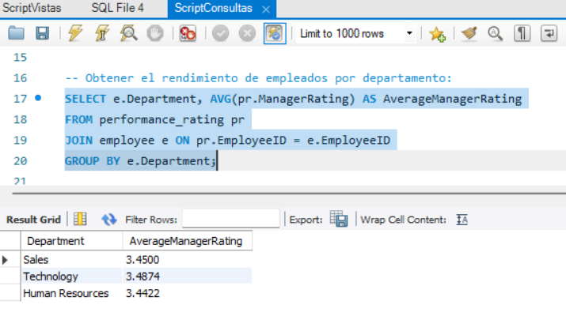
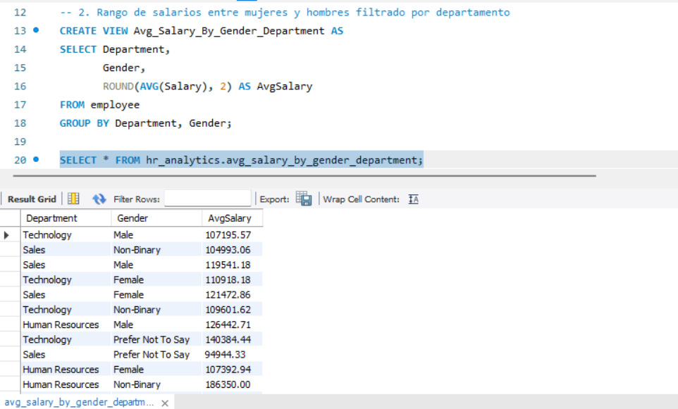
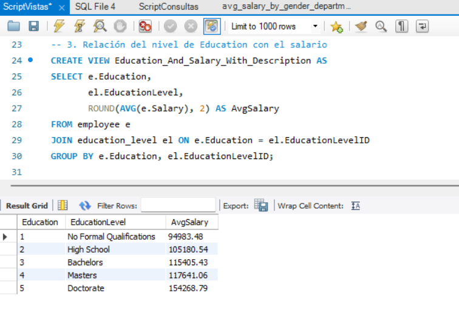

# Proyecto_HR_Analytics
Proyecto en SQL análisis de  aspectos relacionados con la rotación de personas HR_Analytics

## Imagenes de las Consultas/ Vistas

### Cantidad de Empleados por Nivel de Educacion

### Promedio de Desempeño de los Empleados por Departamento

### Promedio de Salarios por Departamento y Genero

### Promedio de Salario por Nivel de Educacion

